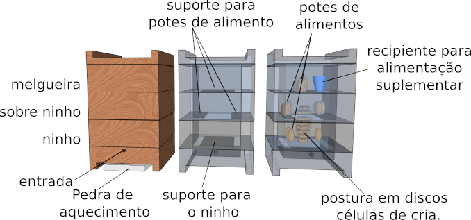
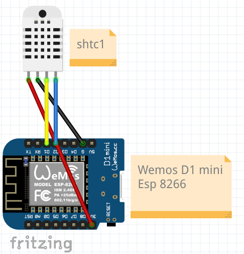
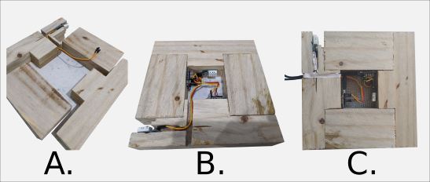

# coletasASF

Nesse repositório está um arquivo CSV com um dataset derivado da coleta de temperatura e umidade de uma caixa de abelha sem ferrão Mandaçaia MQQ, melipona quadrifasciata quadrifasciata.
A coleta foi realizada no período de 15 de fevereiro de 2022 a 10 de março de 2023.

### Caixa modular modelo INPA

A coleta de dados foi realizada em uma caixa modular modelo INPA. A caixa é dividida em módulos, sendo o módulo de ninho, o módulo de sobre-ninho e o módulo de melgueira. A imagem abaixo ilustra a estrutura da caixa:

### Coletor de dados

O coletor de dados foi construído utilizando um microcontrolador ESP8266 (Esp D1 Mini) e um sensor SHTC3. O esquema do coletor é apresentado na imagem abaixo:

O módulo coletor foi acoplado entre a tampa e o módulo mais alto da caixa, conforme a imagem abaixo:

### Arquivo de dados

Os dados coletados foram armazenados inicialmente no SGBD InfluxDB. No entanto, devido a um problema no cartão de memória da Raspberry Pi onde os dados estavam armazenados, a recuperação dos dados tornou-se difícil. Como solução, optou-se por substituir o InfluxDB pelo PostgreSQL. Após a recuperação bem-sucedida dos dados armazenados no InfluxDB, os dados foram inseridos no PostgreSQL. O arquivo resultante, 2011_02_15-2023_03_10.csv, contém as informações coletadas nos sensores "external" e "caixa01".

O dataset possui um total de 1.335.098 linhas com as coletas dos sensores "teste", "Caixa03" e "testePy". Caso esses dados sejam removidos, o arquivo contém 1.333.962 linhas.

Os equipamentos de teste mencionados, "Caixa03" e "testePy", foram utilizados durante o desenvolvimento do código e seus dados não são reais.

Colunas presentes são: 

| Campo | Descritivo |
|---|---------|
|id| Identificador único para linha|
|datetime| Carimbo de data e hora|
|sensor| nome do coletor |
|measure| Tipo da unidade medida, temperature ou humidity |
|valuemeasure| Valor medido |

### Script Python boxplot.py
Desenvolvido para:
* retirar os dados provenientes dos sensores teste, Caixa03 e testePy;
* além de apresentar as estatísticas do dataset;
* apresentar gráfico boxplot agrupados por unidade de medida e sensor.
